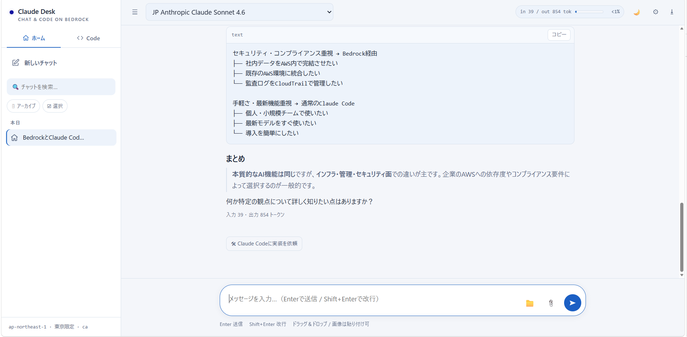
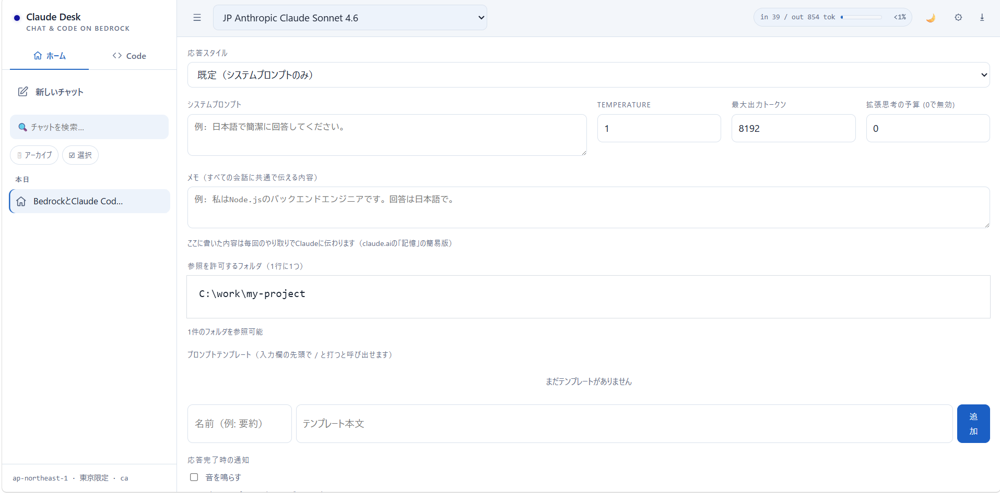
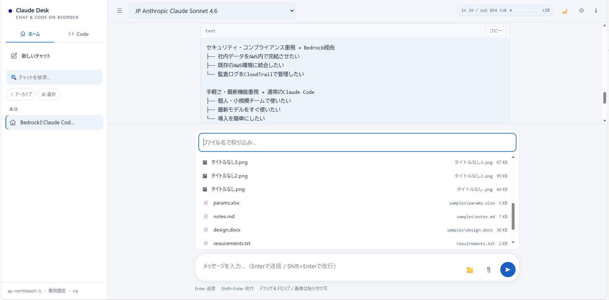

# Claude Desk

**Chat & Code on Amazon Bedrock**


[](https://github.com/sho5sa10/Claude-Desk/releases/latest)

> No Docker. No CDK. No CloudFormation. Just run and chat.
> Docker も CDK も CloudFormation も不要。実行するだけで使えます。

## これは何か

**claude.ai や Claude Desktop が使えない環境のための、ローカルで動く Claude デスクトップ環境**です。
手元のPC（Windows / macOS / Linux）上で Node.js のサーバーを立ち上げ、ブラウザから 2 種類の Claude を使えます。

- **Claude とのチャット** … Amazon Bedrock を直接呼び出します
- **Claude Code との連携** … 手元にインストール済みの `claude` CLI を呼び出して、Repository を調査・実装させます

会話履歴・添付ファイル・設定はすべて同じ PC 内で管理し、外部の SaaS には一切通信しません。Claude Code で使っているのと同じ AWS 認証情報・プロキシ・CA証明書設定がそのまま使えます。

**こんな方におすすめ**

- claude.ai / Claude Desktop へのアクセスが会社のポリシーで塞がれている
- Amazon Bedrock を社内PCから手軽に使いたい
- 既存の AWS 認証情報（Claude Code などで使っているもの）をそのまま使いたい
- 企業のプロキシ / SSLインスペクション環境で利用したい

> **旧名について**: v1.5.0 で "Claude Code Chat on AWS Bedrock" から **Claude Desk** に改名しました。リポジトリも `Claude-Code-Chat_on_aws_bedrock` から `Claude-Desk` に移動しています（旧URLは GitHub のリダイレクトで引き続きアクセスできます）。v1.4.0 以前のリリース資産のファイル名 (`bedrock-chat-vX.X.X.zip`) は当時のまま残っています。

## 2つのモード

画面は「ホーム」と「Code」の2タブに分かれており、**それぞれ呼び出し先も課金先も別**です。スレッドの種類は作成時に固定され、1つのスレッド内で混在することはありません。

| | 🏠 ホーム | 🛠 Code |
|---|---|---|
| 呼び出し先 | Amazon Bedrock の Converse Stream API を**直接**呼び出し | ローカルの `claude` CLI（Claude Code）を起動 |
| 何が得意か | 文書レビュー・要約・設計相談・雑談 | Repository の調査・質問・実装 |
| **課金** | **AWS の Bedrock 利用料** | **Claude Code の利用料**（CLIの起動ごとに発生） |
| ファイル添付 | 対応（画像・PDF・Office・zip） | 非対応（Claude Code が直接 Repository を読みます） |
| ファイルの変更 | しない | 承認制ワークフローを通したときのみ |

## アーキテクチャ

2つの経路は、同じサーバー・同じブラウザ画面を共有しますが、そこから先は完全に別系統です（SSEのエンドポイントも状態も共有していません）。

```
                        ブラウザ (localhost:3210)
                                 │
                        HTTP / SSE（127.0.0.1のみ）
                                 │
                    Node.js / Express (server.js)
                                 │
            ┌────────────────────┴────────────────────┐
            │                                         │
     【ホーム経路】                              【Code経路】
     /api/chat                                  /api/code/*
            │                                         │
            │ Bedrock Converse Stream API             │ 子プロセス起動
            ▼                                         ▼
     Amazon Bedrock ── Claude                   claude CLI (Claude Code)
                                                      │
     課金: AWS の Bedrock 利用料                       │ Repository を読み書き
                                                      ▼
                                              許可フォルダ配下の Repository

                                               課金: Claude Code の利用料
```

Code経路の詳細（Claude Code CLI が返す生の実行イベントは、Code Agent が正規化してから画面に出す）は [Claude Code連携](#claude-code連携) 以降を参照してください。

## 画面イメージ





## 課金の違い

**この2つは請求先が違います。** 画面上でも区別できるようにしています。

| 経路 | 課金されるもの | どこに請求されるか |
|---|---|---|
| ホーム（Bedrock直） | 入力/出力トークン数に応じた Bedrock の従量課金 | AWS アカウント |
| Code（Claude Code CLI） | `claude` の起動ごとに発生する Claude Code の利用料 | Claude Code の契約（サブスクリプション / API クレジット） |

**画面上での見分け方**

- サイドバーのタブが「ホーム」か「Code」か
- Code スレッドではヘッダーに青い `🛠 Claude Code ・ <Repository> ・ <Mode>` バッジが出る（ホバーで課金の注記が出ます）
- スレッドを開いた直後の空画面と、Code チャット開始／実装依頼のモーダルに「Claude Code 側の課金です」という注記が出る

なお、Code スレッドで表示される「概算コスト」は Claude Code CLI 自身が報告した見積もりで、Bedrock の請求額ではありません。

## セキュリティ

- **通信先**: Amazon Bedrock と、ローカルの `claude` CLI だけ。それ以外の外部サービスへは通信しません
- **待ち受け**: サーバーは `127.0.0.1` のみで待ち受けるため、PC外からはアクセスできません
- **許可フォルダ**: ファイル参照・Repository 選択のどちらも、画面で登録した許可フォルダ配下に限定されます。範囲外のパスは、直接指定しても拒否されます（Code経路も同じ `insideRoots()` を再利用しており、別のアクセス制御は作っていません）
- **会話履歴**: ブラウザの localStorage を正本とし、同じPC内の `data/history.json` にバックアップします（ブラウザのサイトデータを消しても履歴が失われないようにするためのもので、外部には送信しません）
- **添付ファイル**: 実体はブラウザのメモリ上のみで扱い、履歴にはファイル名だけを保存します
- **zip添付**: 展開結果をサーバー側でもディスクに書かず、メモリ上に10分だけ保持します
- **コードブロックのプレビュー**: `sandbox="allow-scripts"`（`allow-same-origin` なし）のiframe内で描画し、CSP (`default-src 'none'`) で外部リソースの読み込み・通信をすべて遮断します

### コード変更に関する安全設計

Claude Code にコードを変更させる場合は、必ず次の順序を通ります。

```
Plan（ファイルは変更しない）
  → 人間が承認
  → 隔離ブランチ ai/<セッションID> を作成
  → 実装
  → 検出したテストコマンドのみ自動実行
  → 変更ファイル・テスト結果・Diff を人間が確認
  → 人間が Commit ボタンを押す
```

- **自動 push は一切ありません。** push / merge を行うコードは存在しません
- **commit は「Commitする」ボタンを押したときだけ**実行されます。チャットのやり取りが commit を引き起こすことはありません
- 隔離ブランチの作成は、**作業ツリーが汚れていない（未コミットの変更がない）ときのみ**実行されます。あなたの進行中の作業を巻き込みません
- commit / 破棄は、**その時点で本当に隔離ブランチがチェックアウトされているかを確認**してから実行されます。別のターミナルで手動でブランチを切り替えていた場合は、どちらも拒否されます（無関係な変更を commit したり消したりしないため）
- 「破棄」が消すのは隔離ブランチとその上の変更だけです。`.gitignore` 対象のファイル（`start.local.json` などのローカル設定）は消しません
- Diff 画面には、`git diff` では見えない**新規ファイルや既に staged された変更も含めて**表示されます。「確認した内容」と「commit される内容」が食い違わないようにするためです
- テストは検出した既定のコマンド（`npm test` / `pytest` / `go test` など）のみ実行します。任意のシェルコマンドは実行しません

## ライセンス

MIT License（`LICENSE` を参照）。社内利用・改変・再配布は自由です。

## 必要なもの

- Node.js 18 以上（Claude Code が動いていれば入っています）
- Bedrock の IAM 権限
  - 必須: `bedrock:InvokeModelWithResponseStream`
  - 任意: `bedrock:ListInferenceProfiles` / `bedrock:ListFoundationModels`
    （なくても動きます。モデルIDを画面に直接入力する形になります）
- Code タブを使う場合のみ: `claude`（Claude Code CLI）が PATH 上にあること
  （`CLAUDE_CLI_PATH` 環境変数でパスを明示指定することもできます）

## セットアップ

### 方法A: GitHub Releases から（npm install 不要）

[Releases](https://github.com/sho5sa10/Claude-Desk/releases) から最新の zip をダウンロードして展開するだけです（v1.5.0 以降は `claude-desk-vX.X.X.zip`、v1.4.0 以前は `bedrock-chat-vX.X.X.zip`）。依存パッケージ (`node_modules`) を同梱しているため、Node.js さえ入っていれば `npm install` は不要です。社内配布はこの方法を推奨します。

```powershell
cd 展開したフォルダ
```

Windows（PowerShell）:

```powershell
.\start.ps1
```

macOS / Linux:

```bash
./start.sh
```

初回だけリージョンやプロキシなどをいくつか聞かれます（わからなければ空欄でEnterでOK）。回答は `start.local.json`（Git管理外）に保存され、次回以降は自動で読み込まれます。設定をやり直したいときは `.\start.ps1 -Reconfigure`（macOS/Linuxは `./start.sh --reconfigure`）を実行してください。

### 方法B: ソースから（git clone）

```bash
git clone https://github.com/sho5sa10/Claude-Desk.git
cd Claude-Desk
npm install
```

以降は方法Aと同じく実行するだけです（`.\start.ps1` または `./start.sh`）。

---

ブラウザで <http://localhost:3210>（`PORT`を変更した場合はそのポート）が開きます。AWS未設定などで起動時にエラーがある場合は、画面上部に原因と対処法が表示されます。

`start.ps1` / `start.sh` を使わず、環境変数だけで起動しても構いません。

| 変数 | 用途 |
|---|---|
| `AWS_REGION` | 例 `us-east-1` / `ap-northeast-1`（未設定なら `AWS_PROFILE` のリージョン設定を使用） |
| `AWS_PROFILE` | 名前付きプロファイルを使う場合。`~/.aws/config` にそのプロファイルの `region` が設定されていれば、`AWS_REGION` を別途指定しなくても自動的に使われます |
| `HTTPS_PROXY` | 社内プロキシ（Claude Code と同じ値） |
| `AWS_CA_BUNDLE` | SSLインスペクション用のルート証明書 (PEM) |
| `CLAUDE_CLI_PATH` | `claude` CLI のパス（PATH 上にない場合のみ） |
| `PORT` | 既定 3210 |

リージョンは `AWS_REGION` → `AWS_DEFAULT_REGION` → `AWS_PROFILE` のリージョン設定 → （どれもなければ）`us-east-1` の順で解決します。

## 対応モデル（ホーム経路）

Bedrock でオンデマンド提供されている Anthropic のモデル（Claude Sonnet / Opus / Haiku 系の推論プロファイル）に対応しています。画面のモデル欄はアカウントから自動取得され、権限がない場合はIDを直接入力できます。Anthropic以外のモデル（Amazon Nova等）は現状スコープ外です。

Code経路で使われるモデルは Claude Code CLI 側の設定に従うため、画面のモデル欄は影響しません。CLIが実際に使ったモデルは、ターン実行後にヘッダーのバッジ（`🛠 Claude Code ・ <Repository> ・ <Mode> ・ <モデル>`）に反映されます。

**Code経路がBedrockを経由する保証はない点に注意してください。** このアプリは `claude` CLIをサブプロセスとして起動するだけで、CLI自体の通信先（Bedrock経由か、Anthropicへの直接通信か）はCLI側の設定（`CLAUDE_CODE_USE_BEDROCK`環境変数など）に完全に依存します。環境変数 `CLAUDE_CODE_USE_BEDROCK` が設定されていない場合、Codeタブに切り替えた時点で画面上部に警告バナーを表示します。社内ポリシーでBedrock経由のみが許可されている場合は、この変数が設定されていることを確認してください。

**リージョンロック（東京リージョン利用時）**

リージョンが `ap-northeast-1`（東京）の場合、東京以外へ処理がルーティングされるクロスリージョン推論プロファイル（`global.*` / `apac.*` / `us.*`）は使用できません。`jp.anthropic.*` と、プレフィックスなしの基礎モデル（`anthropic.*`）のみが対象になります。モデル一覧・チャット・タイトル生成のすべてに適用され、有効時はサイドバー下部に「東京限定」と表示されます。データの所在リージョンを東京に限定したい場合の制約です。

## 機能（ホーム経路）

- ストリーミング表示、生成の途中停止
- モデル切り替え（アカウントの推論プロファイルを自動取得）
- システムプロンプト / temperature / 最大出力トークン
- 拡張思考（budget を 1024 以上にすると有効、思考プロセスは折りたたみ表示）
- 応答スタイルのプリセット（簡潔 / 正式 / フレンドリー / 技術的）と、全会話に共通で渡す「メモ」欄
- ファイル添付（クリップボタン / ドラッグ＆ドロップ / 画像はそのまま貼り付け）
  - 画像: png jpg gif webp（1回20件まで）
  - 文書: pdf doc docx xls xlsx csv txt md html（1回5件まで、Bedrock側でテキスト抽出）
  - 1ファイル 4.5MB まで
  - zip: 展開して中身の一覧から必要なファイルだけを選んで添付できます（zip自体は24MBまで）。
    展開結果はサーバー側でもディスクに書かず、メモリ上に10分だけ保持します。
  - 添付の実体はブラウザのメモリ上だけに置き、履歴にはファイル名のみ保存します。
    ページを再読み込みすると添付は外れるため、続けて質問する場合は貼り直してください。
- 許可フォルダからの参照（📁ボタン）
  - ⚙ の設定で「参照を許可するフォルダ」を1行に1つ登録すると、その配下のファイルを
    ドラッグせずに一覧から選べます（ファイル名で絞り込み可）。
  - 登録はブラウザ側の設定として保存され、サーバーはメモリ上にのみ保持します。
    登録フォルダの外は、パスを直接指定しても読み取りを拒否します。
  - 選んだファイルはパスだけを保持するため、再読み込み後も履歴から選び直せます。
- 会話履歴はブラウザの localStorage に保存し、同じPC内の `data/history.json` にバックアップ
  （ブラウザのサイトデータを消してしまっても、次回アクセス時に復元されます）
- 会話タイトルの自動生成（最初の一往復からClaudeが短いタイトルを付けます）
- 会話の検索・ピン留め・アーカイブ・複製、`/` で呼び出すプロンプトテンプレート
- コードブロックのコピー、HTML / SVG / XML のその場プレビュー、会話の Markdown 書き出し
- 入出力トークン数の表示と、コンテキスト使用量バー（200Kトークンに対する概算）
- ダークモード（OS設定に自動追従、明示的な切替も可能）

## Claude Code連携

Code経路の入口は2つあります。どちらも最終的には同じ承認制ワークフローを通ります。

### 1. Claude Codeチャット（会話モード）

Claude Code を**継続した会話の相手**として使うモードです。claude.ai のチャットが使えない環境で、Claude Code をバックエンドにしたチャット体験を提供します。

```
Claude Desk の Code タブ
      │  自然文で質問
      ▼
Code Session（code-agent/sessions.js）
      │  1ターン目は起動、2ターン目以降は --resume で継続
      ▼
claude CLI が対象Repositoryを調査・回答
      │  進捗イベント（SSE）
      ▼
同じチャット画面に回答・ツール利用ログを表示
```

**使い方**

1. サイドバーの Code タブ →「Claude Codeと会話する」をクリックする
2. Repository と Mode（既定 `Plan only`）を選んで「開始」
3. 通常のチャットと同じ入力欄から、そのRepositoryについて自然文で質問する
4. 2回目以降の発言は同じ Claude Code セッションを継続します（会話履歴を毎回再送信する必要はありません）

Mode を選ばずに Code タブでそのまま入力して送信することもできます（前回使った Repository / Mode を再利用します。曖昧な場合のみ選択画面が出ます）。

### 2. 設計相談からの実装依頼（一回きり）

ホームで相談した内容を、人間が確認したうえで Claude Code に実装させる連携です。

```
ホームで Claude と設計相談
      │
      ▼
人間が実装指示を確認・編集
      │  「🛠 Claude Codeに実装を依頼」→「実装開始」
      ▼
新しい Claude Codeスレッドを作成し、計画（Plan）を開始
      │
      ▼
以降は下記「実装ワークフロー」と同じ
（承認 → 実装 → テスト → Diff確認 → Commit）
```

1. ⚙ の設定パネルで「参照を許可するフォルダ」に、Claude Code を動かしたいリポジトリのパスを登録する
2. Claude とチャットで設計相談する
3. Claude の回答に表示される「🛠 Claude Codeに実装を依頼」をクリックする
4. モーダルで対象 Repository を選択する（手順1で登録したフォルダから選べます）
5. Implementation Prompt を確認し、必要なら編集する（Claude の回答をそのまま自動送信はしません）
6. 「実装開始」を押すと、新しい Claude Codeスレッドが作成され、そのプロンプトで計画（Plan）が自動的に始まります

**設計上の要点**

- Claude Code の生の実行イベント（ツール一覧・MCP接続・内部ファイルパスなどを含む）はそのまま画面に出さず、Code Agent が安全な形に正規化してから表示します
- Repository へのアクセスは、通常のチャットと同じ「許可フォルダ」の仕組みで制限されます。許可フォルダ外は選択できません
- ファイル変更・commit を伴う実行は、必ず下記の実装ワークフローを経由します。自動でファイルを書き換えたり commit / push したりすることはありません

## 実装ワークフロー（Plan → 承認 → 実装 → テスト → Diff確認 → Commit）

Claude Codeチャットの入力欄には、通常の送信ボタンとは別に「📋」ボタンがあります。これは実際にコードを変更してほしいときに使う、承認ポイント付きの実装フローです。

```
📋 で計画を依頼
      │
      ▼
Claude Codeが計画を提示（ファイルは一切変更しません）
      │  人間が確認
      ├─ 修正を依頼 → 計画を練り直し
      ├─ キャンセル
      ▼
「実装を開始」
      │
      ▼
一時ブランチ（ai/<セッションID>）を作成し、その上で実装
      │  作業ツリーが汚れている場合は、ここで中止されます
      ▼
検出したテストコマンドを自動実行（npm test / pytest / go test など）
      │
      ▼
変更ファイル一覧・テスト結果・Diffを表示（新規ファイルの内容も含みます）
      │  人間が確認
      ├─ 修正を依頼 → 実装をやり直し
      ├─ 破棄 → 一時ブランチとその上の変更をすべて取り消し、元のブランチに戻る
      ▼
Commit message を確認・編集して「Commitする」
      │
      ▼
その場で commit（push は行いません）
```

安全のための設計は「[コード変更に関する安全設計](#コード変更に関する安全設計)」にまとめています。この保証は `test/git-adapter.test.js`・`test/git-info.test.js`・`test/workflow.test.js` の回帰テストで担保しています（実際に一時 git リポジトリを作って検証します）。

## うまくいかないとき

**`Could not load credentials from any providers`**
Claude Code を動かしているのと同じシェルの認証情報が見えていません。`AWS_PROFILE` を指定するか、SSO なら `aws sso login` を実行してから起動してください。

**`self-signed certificate in certificate chain` / `unable to get local issuer certificate`**
`AWS_CA_BUNDLE` と `NODE_EXTRA_CA_CERTS` に Zscaler のルート証明書 (PEM) を指定します。証明書は BOM なし・PEM形式で保存してください。

**`npm install` が通らない**
```powershell
npm config set proxy http://proxy.example.co.jp:8080
npm config set https-proxy http://proxy.example.co.jp:8080
npm config set cafile C:\certs\zscaler-root.pem
```

**`AccessDeniedException` / `ValidationException: model not found`**
そのリージョンでモデルが有効化されていないか、クロスリージョン推論プロファイル ID（`apac.` や `us.` で始まるもの）が必要です。設定画面のモデル欄に、Claude Code で使っているモデルIDをそのまま入れてください。

**`ThrottlingException`**
オンデマンドのレート上限です。しばらく待つか、別リージョンのプロファイルを選んでください。

**Code タブで「実装を開始」が拒否される（`repository has uncommitted changes`）**
隔離ブランチは作業ツリーがきれいなときにしか作りません。未コミットの変更を commit するか stash してから、もう一度承認してください。

**Code タブで Commit / 破棄が拒否される（`isolation branch ... is not currently checked out`）**
別のターミナルで手動でブランチを切り替えた状態です。無関係な変更を commit したり消したりしないよう、意図的に拒否しています。元の `ai/<セッションID>` ブランチに戻してから操作してください。

**しばらく起動したままにしていたら、チャットが無反応になった**
SDKが起動時にキャッシュした認証情報が古くなっている可能性があります。`start.ps1`（macOS/Linuxは`start.sh`）を再実行してサーバー自体を再起動してください。

## 同僚に配るとき

`node_modules` を含めた状態でフォルダごと配ると、社内でのインストールが不要になります。
ポートは 127.0.0.1 のみで待ち受けるため、PC外からはアクセスできません。

## Roadmap

未実装のものだけを挙げています。

- 会話のエクスポート形式の追加（現在は Markdown のみ）
- 会話の分岐（同じ地点から複数の応答を保持して切り替え表示）
- Artifactsプレビューの拡張（現在は HTML / SVG / XML のみ。React実行・コード実行は未対応）

## このプロジェクトについて

Claude Desk は、claude.ai や Claude Desktop に手が届かない環境でも Claude を日常業務に使えるようにするために作りました。中心にあるのはホーム経路の直接チャットで、文書レビューや要約、設計書の確認といった日常業務での利用を意識しています。Code 経路（Claude Code連携）は、その相談の続きをそのままコードに落とすための追加機能という位置づけです。Claude Code と同じ AWS 認証情報を使い回せる点、社内ネットワークやプロキシ環境、SSLインスペクション環境でも問題なく使える点を重視しています。
