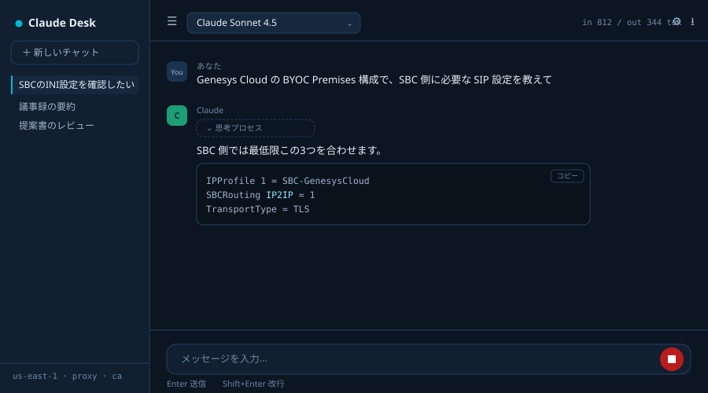
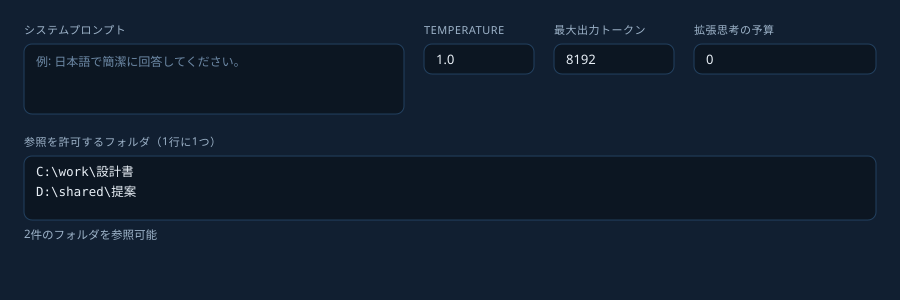
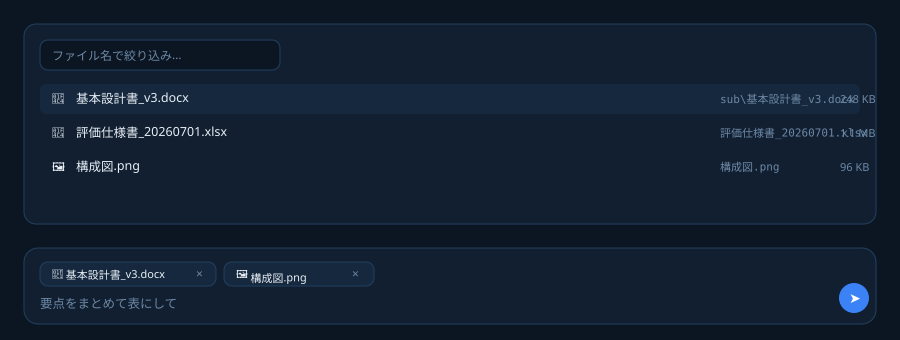

# Bedrock Chat — Claude on Amazon Bedrock

Amazon Bedrock 用のローカルチャットアプリです。企業のセキュリティポリシーを考慮し、通信先は Bedrock のみ、会話履歴や添付ファイルはローカルで管理します。Claude Code と同じ AWS 認証情報も利用できます。

## 特徴

- ✅ Claude Code と同じ AWS 認証情報を利用
- ✅ 通信先は Amazon Bedrock のみ（外部SaaSを経由しない）
- ✅ ストリーミング表示・生成の途中停止
- ✅ ファイル添付・許可フォルダからの参照
- ✅ 拡張思考（Thinking）表示に対応
- ✅ Zscaler 等のSSLインスペクション環境に対応（プロキシ・CA証明書設定）
- ✅ Windows PC上だけで完結、127.0.0.1 のみ待ち受け

## アーキテクチャ

```
ブラウザ (localhost)
      │  HTTP / SSE
      ▼
Node.js / Express サーバー（127.0.0.1のみ待受）
      │  Bedrock Converse Stream API
      ▼
Amazon Bedrock ── Claude
```

## 画面イメージ





## 対応モデル

Bedrock でオンデマンド提供されている Anthropic のモデル（Claude Sonnet / Opus / Haiku 系の推論プロファイル）に対応しています。画面のモデル欄はアカウントから自動取得され、権限がない場合はIDを直接入力できます。Anthropic以外のモデル（Amazon Nova等）は現状スコープ外です。

## セキュリティ

- 通信先は Amazon Bedrock のみ（他の外部サービスへは通信しません）
- 会話履歴はブラウザの localStorage に保存し、サーバー側には残しません
- 添付ファイルの実体はブラウザのメモリ上のみで扱い、履歴にはファイル名だけを保存します
- フォルダ参照は画面で登録した許可フォルダの配下のみに限定し、範囲外のパスは拒否します
- サーバーは 127.0.0.1 のみで待ち受けるため、PC外からはアクセスできません

## ライセンス

MIT License（`LICENSE` を参照）。社内利用・改変・再配布は自由です。

## 必要なもの

- Node.js 18 以上（Claude Code が動いていれば入っています）
- Bedrock の IAM 権限
  - 必須: `bedrock:InvokeModelWithResponseStream`
  - 任意: `bedrock:ListInferenceProfiles` / `bedrock:ListFoundationModels`
    （なくても動きます。モデルIDを画面に直接入力する形になります）

## セットアップ

```powershell
cd bedrock-chat
npm install
```

`start.ps1` の先頭を自分の環境に合わせて書き換えて実行します。

```powershell
.\start.ps1
```

ブラウザで <http://localhost:3210> が開きます。

環境変数だけで起動しても構いません。

| 変数 | 用途 |
|---|---|
| `AWS_REGION` | 例 `us-east-1` / `ap-northeast-1` |
| `AWS_PROFILE` | 名前付きプロファイルを使う場合 |
| `HTTPS_PROXY` | 社内プロキシ（Claude Code と同じ値） |
| `AWS_CA_BUNDLE` | SSLインスペクション用のルート証明書 (PEM) |
| `PORT` | 既定 3210 |

## 機能

- ストリーミング表示、生成の途中停止
- モデル切り替え（アカウントの推論プロファイルを自動取得）
- システムプロンプト / temperature / 最大出力トークン
- 拡張思考（budget を 1024 以上にすると有効、思考プロセスは折りたたみ表示）
- ファイル添付（クリップボタン / ドラッグ＆ドロップ / 画像はそのまま貼り付け）
  - 画像: png jpg gif webp（1回20件まで）
  - 文書: pdf doc docx xls xlsx csv txt md html（1回5件まで、Bedrock側でテキスト抽出）
  - 1ファイル 4.5MB まで
  - 添付の実体はブラウザのメモリ上だけに置き、履歴にはファイル名のみ保存します。
    ページを再読み込みすると添付は外れるため、続けて質問する場合は貼り直してください。
- 許可フォルダからの参照（📁ボタン）
  - ⚙ の設定で「参照を許可するフォルダ」を1行に1つ登録すると、その配下のファイルを
    ドラッグせずに一覧から選べます（ファイル名で絞り込み可）。
  - 登録はブラウザ側の設定として保存され、サーバーはメモリ上にのみ保持します。
    登録フォルダの外は、パスを直接指定しても読み取りを拒否します。
  - 選んだファイルはパスだけを保持するため、再読み込み後も履歴から選び直せます。
- 会話履歴はブラウザの localStorage に保存（サーバーには残りません）
- コードブロックのコピー、会話の Markdown 書き出し
- 入出力トークン数の表示

## うまくいかないとき

**`Could not load credentials from any providers`**
Claude Code を動かしているのと同じシェルの認証情報が見えていません。`AWS_PROFILE` を指定するか、SSO なら `aws sso login` を実行してから起動してください。

**`self-signed certificate in certificate chain` / `unable to get local issuer certificate`**
`AWS_CA_BUNDLE` と `NODE_EXTRA_CA_CERTS` に Zscaler のルート証明書 (PEM) を指定します。証明書は BOM なし・PEM形式で保存してください。

**`npm install` が通らない**
```powershell
npm config set proxy http://proxy.example.co.jp:8080
npm config set https-proxy http://proxy.example.co.jp:8080
npm config set cafile C:\certs\zscaler-root.pem
```

**`AccessDeniedException` / `ValidationException: model not found`**
そのリージョンでモデルが有効化されていないか、クロスリージョン推論プロファイル ID（`apac.` や `us.` で始まるもの）が必要です。設定画面のモデル欄に、Claude Code で使っているモデルIDをそのまま入れてください。

**`ThrottlingException`**
オンデマンドのレート上限です。しばらく待つか、別リージョンのプロファイルを選んでください。

## 同僚に配るとき

`node_modules` を含めた状態でフォルダごと配ると、社内でのインストールが不要になります。
ポートは 127.0.0.1 のみで待ち受けるため、PC外からはアクセスできません。

## このプロジェクトについて

Claude Code と同じ AWS 認証情報を利用しながら、ブラウザで気軽に Amazon Bedrock を利用したいという目的で作成しました。Claude Code は開発向け、Bedrock Chat は日常的な業務利用向けという位置づけです。社内ネットワークやプロキシ環境、SSLインスペクション環境でも問題なく使えることを重視しています。
